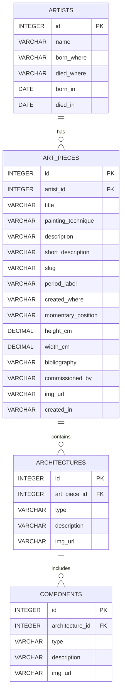

# Painted Architectures 
By: William Mancy
Video URL: 

## Table of contents
1. Scope
2. Functional Requirements
3. Representation
4. Entities
5. Relationships
6. Optimizations
7. Limitations


## 1. SCOPE
The idea for this database came to me a couple of months back, born from a conversation with a friend that is currently studying for his PHD in art. He talked to me about collecting information about architectures and their elements inside painted arts between 1350 and 1550 AD.

The database aims to collect data about all painted art that contains architectures between 1350 and 1550 AD. More specifically it collects artists data, their painted art, the architectures within the art and the elements that compose the architecture

There is no interest in collecting data from other time periods or from artists that do not include architectures in their art since it's outside of the database's purpose

## 2. FUNCTIONAL REQUIREMENTS
The database was designed to fit a webapp where an admin could modify and insert more data, while a viewer could search by multiple fields (such as period, description, or architectural features) to find pieces that match their interests. The database already includes a slug for artpieces and a long description(detail page) and a short description(to be read while looking for art pieces). The database includes:
- **Art pieces**
- **Artists**
- **Architectures** 
- **Architectural Elements**


Which people, places, things, etc. are outside the scope of your database?
The database does not aim to:
- **Track movements of artpieces through out their existance**
- **Track historical events related to the art piece**
- **Include in depth information about the artist**
- **Track people that restored the art or the number of restorations**


## REPRESENTATION AND ENTITIES
 #####  ENTITIES AND MAIN ATTRIBUTES: 
  


##### REASONING AND CONSTRAINTS
1. ARTISTS:
- name, born_where and died_where are VARCHARS to avoid that a mistake would insert wrong or dangerous values inside the database, the type is ment to collect strings
- born_in and died_in are DATES to give some basic information about the artist and potentially query artists based on their year of birth or year of death e.g. figuring out the decade that had the most artists born that painted architectures.
- most attributes have the 'NOT NULL' constraint and the CHECK that an artist died after he was born since the inverse is impossible
- The choice of using only name instead of first and last name is for data retrieval reasons and using DEFAULT 'Autore Sconosciuto' which stands for 'Unknown Author' in italian.
1.  **ART PIECES:** 
- artist_id tells us who painted the art
- title,painting technique, description, short_description, slug, period_label, created_where, momentary_position, commissioned_by, img_url and created_in are VARCHARS
- created_in is a VARCHAR because looking online most art pieces where not created in a single year therefore DATE or TIMESTAMP couldn't represent all of the required information. It's suggested to use this format: 'start_year-end_year' to allow queries to split the field and analyze how many art pieces were started in a given year.
- img_url is a VARCHAR because it will reference the url of the image and it's not the image itself.
- period_label works as a sort of GROUP BY on the period the art pieces are made to allow the viewers to query in an easier way.
- painting_technique initially had it's own table but while writing the example queries I understood that it was an information I almost always wanted to display. Considering that most operations on this database will be query operations I decided to merge both entities to remove a JOIN on almost every query regarding this entity
- slug is useful to make a nicer looking url and uses the UNIQUE constraint
- width and height are DECIMALS and are used to keep track of the dimension of the art piece and query for big or small art pieces
3. ARCHITECTURES
- art_piece_id is the FOREIGN KEY that allows us to know in which painted art we can find the architecture.
- description and image_url are VARCHARS and contain the description and the url to the image that the viewers will see.
- **type:** After speaking to my friend who had the idea I realized that my initial idea of having a name and type(in another table, here as a foreign key) was unnecessary since most architectures differ from each other and therefore a 'descriptive type' would almost always be unique and more details could be given in the description. This is why *there is no name attribute*.
4. COMPONENTS
-  architecture_id is the FOREIGN KEY that allows us to know what architecture the component belongs to.
- The rest was chosen and works exactly as 'ARCHITECTURES'

**GENERAL CONSTRAINTS AND REASONING** 
A small discussion on normalization and the main db operations:
> The database could have been normalized more, however since most operations will be query operations I have chosen to simplify it in this way without having other entities for locations, painting techniques, type of architecture, type of component and so on. For bibliography I used VARCHAR(3000) because depending on the art piece the number of references to it can be massive but only the most important ones will be included.

General considerations about unmentioned constraints:
> To see the full list of constraints refer to my database schema, most fields use the NOT NULL constraint other than some dates which might be missing, my views show the meaningful field that are NULL or empty to allow the admin to easily UPDATE those record with correct informations. Some fields use DEAFULT 'Sconosciuta' which stands for DEFAULT 'Unknown' for fields which could not be known. 


## RELATIONSHIPS
> The database was designed entirely on simple **one to many relationships**, which ensure clarity, consistency and easy data retrieval.

- **Artists => Art pieces**
One artist can create **multiple** art pieces, but each art piece is linked to **a single artist**.

- **Art pieces => Architectures**
One art piece can include **multiple** architectural elements, but each architecture belongs to **only one** art piece.

- **Architectures => Components**
One architecture can contain **multiple** components, but each component is associated with **a single architecture**.


## OPTIMIZATIONS
> This section explains the choice of indexes and views created

##### INDEXES
After trying out some example queries, I used **EXPLAIN QUERY PLAN** to see how the database was actually fetching the data. Based on what I saw, I added a few indexes to speed things up and make the queries more efficient.

```
CREATE INDEX idx_art_pieces_artist_id ON art_pieces(artist_id);
CREATE INDEX idx_art_pieces_period_label ON art_pieces(period_label);
CREATE INDEX idx_art_pieces_technique ON art_pieces(painting_technique);
CREATE INDEX idx_architectures_art_piece_id ON architectures(art_piece_id);
CREATE INDEX idx_components_architecture_id ON components(architecture_id);
```


##### VIEWS
The views I created are usefull to retrieve data that needs cleaning by looking at **NULL or empty values**. 

- Artist with missing or NULL attributes
- Architectures with missing descriptions which is will be used on the details page
- Art pieces with missing or NULL attributes


## LIMITATIONS
> This section will discuss the limitations of my database: design limitations, what it may not be able to represent well.

- To allow easier retrieval of painting_techniques I may expose my database to duplicates with slightly different names, a query selecting DISTINCT(painting_techniques) Ordered by painting technique ASC could easily show this problem ('olio su tela' <> 'Olio su tela')
- Location has the same problems as above and COUNT(CASE WHEN born_in = 'London' THEN 1 ELSE 0 END) may give incorrect results. The solution is the same as before.
- A users table is missing since I don't need to track who visits the website and the insertion of data will probably be done directly inside the database. This is unsafe and doesn't allow to retain users informations
- I don't  keep track of any changes to the data, for example I only know that a particular art piece is in London now but if it moves I'll not be able to track the older information.
- If an art piece was made by more than one artist I couldn't keep track of both artists since my relations don't allow this, to solve this I'd neet to create a **many to many relationship** between artists and art_pieces
- Even though the names are all in english the database is ment to collect data in italian, translating it all in english would require rethinking of the database
- Tags could be added to allow better grouping and speed of retrieval of paintings that share a particular feature.
